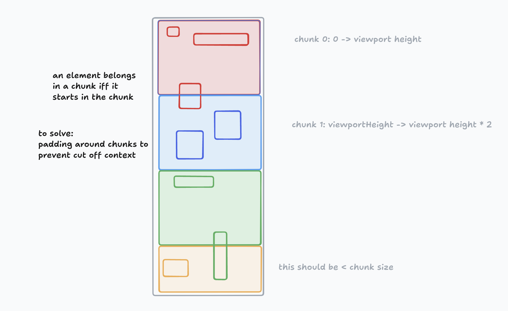

# Stagehand

Stagehand is a web automation SDK that leverages LLMs, [Playwright](https://playwright.dev/), and browser techniques to achieve a low friction, cost effective, and resilient way to automate the browser.

## Getting started

Currently in order to run Stagehand you'll need to create a tarball via the build step. This will be provided by the Browserbase team, or can be generated following the steps below.

here's an example using npm to install a local tarball:

```bash
npm install {PATH_TO_PACKAGE}/{stagehand}-{VERSION}.tgz
```

next, you'll need a `.env` file with the following providers

```
OPENAI_API_KEY=""
BROWSERBASE_API_KEY=""
```

If you are developing stagehand, you'll also need a Braintrust key to run evals

```
BRAINTRUST_API_KEY=""%
```

install dependencies, and you're ready to go! Here's a full example of initializing and running an automation.

> [!NOTE]
> You may need to follow additional playwright instructions to install chromium if you have not done so previously

```typescript
import { Stagehand } from "../lib";
import { z } from "zod";

async function example() {
  const stagehand = new Stagehand({
    env: "LOCAL",
    verbose: true,
    debugDom: true,
  });
  await stagehand.init();
  await stagehand.page.goto("https://www.nytimes.com/games/wordle/index.html");
  await stagehand.act({ action: "start the game" });
  await stagehand.act({ action: "close tutorial popup" });
}
```

### Options

- `env`: where the automation runs. either 'LOCAL' or 'BROWSERBASE' which requires a key in your `.env`
- `verbose`: a boolean that enables more logging during automation
- `debugDom`: a boolean that draws bounding boxes around elements presented to the LLM during automation.

### Methods

#### act

act allows stage hand to do something on a page. provide an `action` like "search for 'x'", or "select the cheapest flight presented". While the SDK will attempt to accomplish substeps, small atomic goals perform the best.

#### extract

extract grabs structured text from the current page using [zod](https://github.com/colinhacks/zod) and [instructor](https://github.com/instructor-ai/instructor-js). given an `instruction` and `schema`, you will receive structured data back. Unlike some extraction libraries, stagehand can extract any information on a page, not just main article contents.

#### observe

observe is useful to assert a state about the current page without knowing exactly where it is, or how to select it. All you need to provide is an `observation` like "Find the calendar on the page", and the method will succeed with an element or throw an error if one cannot be found.

> [!CAUTION]
> observe currently does not support chunking, so at this time you can only observe the first section of the website. This should be fixed
> or the method should be removed if no longer useful

#### ask

ask is a generic LLM call in case you don't want to bring your own agent infrastructure. You can ask any question and provide
context from previous abstractions or actions and get an LLM powered response.

For example:

```typescript
const prompt = `I'm trying to win wordle. what english word should I guess given the following state? Don't repeat guesses
          guesses: \n ${guesses.map((g, index) => `${index + 1}: ${g.guess} ${g.description}`).join("\n")}
        `;
const response = await stagehand.ask(prompt);
```

You can use ask to build a simple wordle bot without additonal libraries or abstractions.

#### downloadPDF

Because PDFs are natively handled by the browser, stagehand provides a utility to make that easier.

```typescript
async function downloadPDF(url: string, title: string);
```

The SDK overrides the default behavior of opening the PDF, and instead creates a download on the file system running the SDK.

## Development

first, clone the repo

`git clone git@github.com:browserbase/stagehand.git`

then install dependencies

`pnpm install`

add the .env file as documented above in the getting started section

run the example

`pnpm example`

run evals

`pnpm evals`

A good development loop is:

1. try things in the example file
2. use that to make changes to the SDK
3. write evals that help validate your changes

### Building the SDK

for simplicity sake, stagehand uses [tsup](https://github.com/egoist/tsup) to build the sdk, and vanilla `esbuild` to build scripts that run in the DOM.

1. run `pnpm build`
2. run `npm pack` to get a tarball for distribution

when stagehand is more broadly accessible, version management and an `npm publish` flow will be incorporated

## How it works

The SDK has 2 major phases. Processing the DOM to make LLM interactions feasible, and taking LLM powered actions based on the current state of the DOM

### DOM processing

Stagehand uses a combination of techniques to prepare the DOM. As of this version, Stagehand only uses text input, but with the release of gpt-4o incorporating vision is under serious consideration.

Processing at a high level works like this

- Via playwright, inject a script into the DOM accessible by the SDK that can run processing
- Crawl the DOM, and create a list of candidate elements
- Candidate elements are either leaf elements (DOM elements that contain actual user facing substance), or are interactive elements
  - Interactive elements are determined by a combination of roles and HTML tags
- Candidate elements that are not active, visible, or at the top of the DOM are discarded
  - The LLM should only receive elements it can faithfully act on on behalf of the agent/user
- For each candidate element, an xPath is generated. this guarnetees that if this element is picked by the LLM, we'l be able to reliably target it.
- Return both the list of candidate elements, as well as the map of element to xPath selector across the browser back to the SDK, to be analyzed by the LLM

#### Chunking

While LLMs will continue to get bigger context windows and improve latency, giving any reasoning system less stuff to think about will make it more accurate. As a result, DOM processing is done in chunks in order to keep the context small per inference call. In order to chunk, the SDK considers an candidate element that starts in a section of the viewport to be a part of that chunk. In the future, padding will be added to ensure that an individual chunk does not lack relevant context. See this diagram for how it looks



### LLM analysis

Now that we have a list of candidate elements and a way to select them. We can present those elements with additional context to the LLM for extraction or action. While untested at a high scale, presenting a "numbered list of elements" guides the model to not treat the context as a full DOM, but as a list of related but independent elements to operate on.

In the case of action, we ask the LLM to write a playwright method in order to do the correct thing. In our limited testing, playwright syntax is much more effectively used than relying on built in javascript APIs.

Lastly, we use the LLM to write future instructions to itself to help manage it's progress and goals when operating across chunks.

## Credits

This project heavily relies on [Playwright](https://playwright.dev/) as a resilient backbone to automate the web. It also would not be possible without the awesome techniques and discoveries made by [tarsier](https://github.com/reworkd/tarsier), and [fuji-web](https://github.com/normal-computing/fuji-web)
